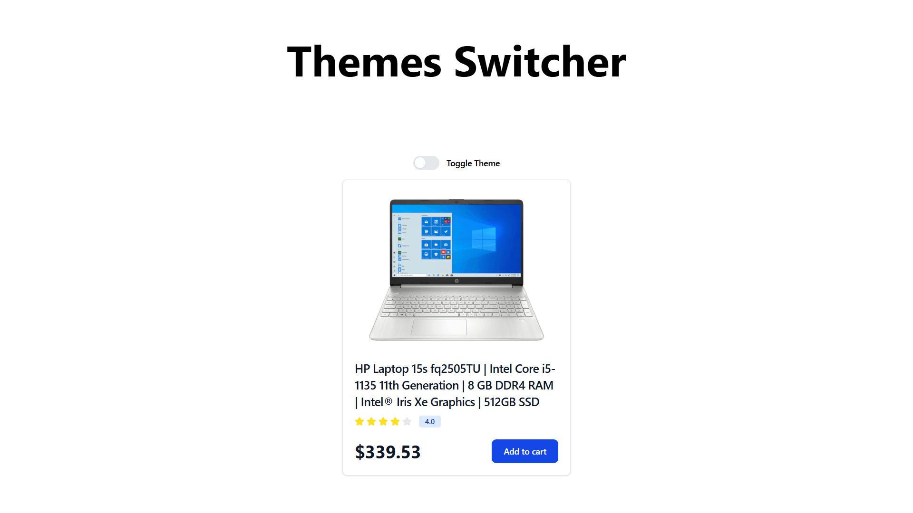
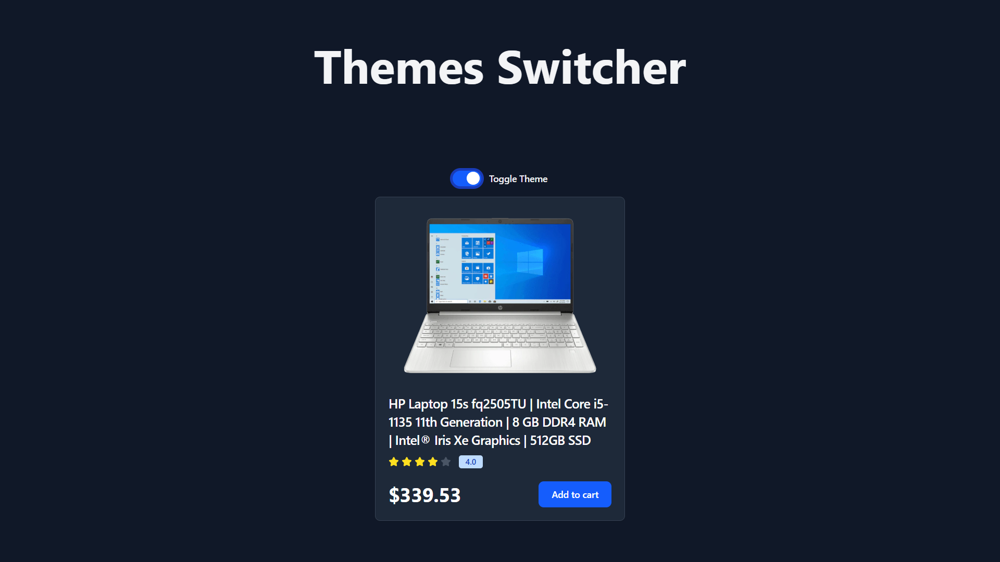

# Themeswitcher - React + Vite

This project is a theme switcher application built using React and Vite. It allows users to toggle between light and dark themes.

## Features

- **React**: A modern JavaScript library for building user interfaces.
- **Vite**: A fast and modern build tool for web development.
- **Tailwind CSS**: A utility-first CSS framework.
- **ESLint**: A tool for maintaining code quality.

## Installation

1. **Clone the repository**:
   ```bash
   git clone https://github.com/Ahmedkhan-dev99/themeSwitcher
   cd themeswitcher
   ```

2. **Navigate to the directory**:
   ```bash
   cd passwordgenerator
   ```


3. **Install dependencies**:
   ```bash
   npm install
   ```

4. **Run the application**:
   ```bash
   npm run dev
   ```

5. **Select your preferred theme**: Use the toggle button in the application to switch themes.

## Screenshot





## Usage

The application includes two official plugins:

- [@vitejs/plugin-react](https://github.com/vitejs/vite-plugin-react/blob/main/packages/plugin-react/README.md): Uses Babel for Fast Refresh.
- [@vitejs/plugin-react-swc](https://github.com/vitejs/vite-plugin-react-swc): Uses SWC for Fast Refresh.

## Expanding the ESLint Configuration

If you are developing a production application, we recommend using TypeScript and enabling type-aware lint rules. Check out the [TS template](https://github.com/vitejs/vite/tree/main/packages/create-vite/template-react-ts) to integrate TypeScript and [`typescript-eslint`](https://typescript-eslint.io) into your project.

## License

This project is licensed under the MIT License.
